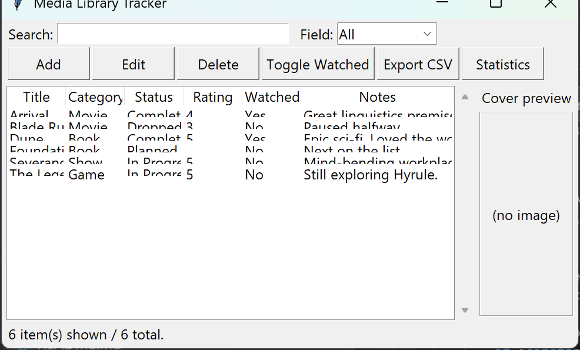
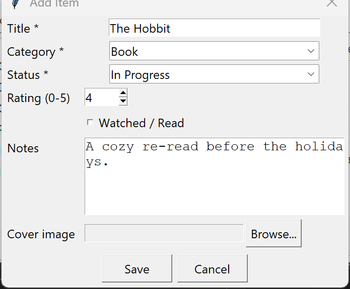
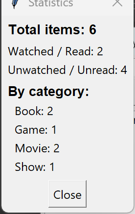

# Media Library Tracker

## Description
A local-only media cataloging app that tracks books, movies, games, shows, etc. with search, filter,
sorting, statistics and CSV export. Built in Python with an object-oriented design and a Tkinter GUI.
All data is stored locally in a JSON file — no external services or database required.

## Features
- Catalog structure per item: Title, Category, Status, Rating, Notes, Watched/Read flag, optional cover image.
- Add, edit, view and delete items, persisted automatically to a local JSON file.
- Search across title/category/status/notes, and sort by clicking any column header.
- "Mark as watched/read" toggle button.
- Export the currently filtered/sorted list to CSV.
- Optional poster/cover image per item, with an in-app preview (requires Pillow).
- Statistics window: total items, watched vs. unwatched, and totals by category.
- Input validation and error handling for missing/invalid data (empty title, out-of-range rating,
  corrupted storage file, unknown item id, etc.).

## Getting Started

### Requirements
- Python 3.10+
- Tkinter (bundled with the standard Python installer on Windows/macOS; on Linux install
  `python3-tk` via your package manager if it's missing)
- Pillow (optional, only used to render cover image previews — the app still works without it)

### Installation
1. Clone this repository or download the files.
2. (Optional, for cover image previews) install the dependency:
   ```
   pip install -r requirements.txt
   ```

### Running the app
```
python main.py
```
The library is stored in `data/library.json`, created automatically on first launch/save.

### Running the tests
```
python -m unittest discover -s tests
```

## Project Structure
```
main.py                  Application entry point
src/media_item.py        MediaItem class (OOP model, Category/Status enums, validation)
src/media_library.py     MediaLibrary class (JSON persistence, CRUD, search, sort, stats, CSV export)
src/gui.py                Tkinter GUI (main window, add/edit dialog, statistics window)
tests/                   Unit tests covering the model and library layer, including edge cases
data/library.json        Local JSON storage (created at runtime)
```

## Screenshots

Main window — browse, search and sort the catalog:



Add/edit dialog:



Statistics window:



## Keep in mind
The code is written in OOP: `MediaItem` encapsulates a single catalog entry with validated
properties, and `MediaLibrary` encapsulates the collection, persistence and querying logic. The
GUI layer only calls into these classes and never touches the JSON file directly.

